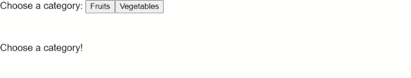

# NgxCategorySelector

This project was generated with [Angular CLI](https://github.com/angular/angular-cli) version 10.1.6.

## Installation

`npm i @rzdesign/ngx-category-selector`

## API
`import {NgxCategorySelectorModule} from '@rzdesign/ngx-category-selector';`

Selector: `lib-ngx-category-selector`

### @Inputs()

| Input            | Type            | Required                   | Description                                                                                               |
| ---------------- | --------------- | -------------------------- | --------------------------------------------------------------------------------------------------------- |
| data             | CategoryNode[ ] | **YES**                    | Array of CategoryNodes                                                |

### @Outputs()

| Output           | Type         | Required | Description                                            |
| ---------------- | ------------ | -------- | ------------------------------------------------------ |
| selection        | CategoryNode | **YES**  | Emits the selected category node                       |

## Development server
 1. run `npm run build-ngx-category-selector`. This will auto rebuild the lib on changes.       
 2. Run `ng serve` for a dev server. Navigate to `http://localhost:4200/`. The app will automatically reload if you change any of the source files.
 

## :mailbox_with_mail: License & Postcardware

The package is completely free (MIT license) to use, however the package is licensed as Postcardware. This means that if it makes it to your production environment, we would very much appreciate receiving a postcard from your hometown.

**RZdesign**,
Becsi way 225 8/45,
1032 Budapest,
Hungary
